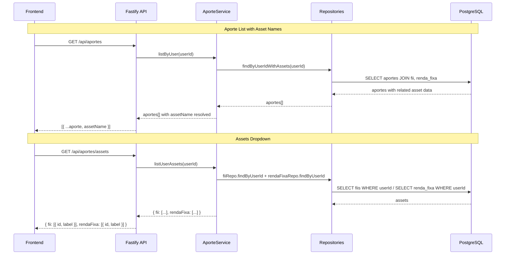

# Design Document: Aporte Asset Selector

## Overview

This feature enhances the Aporte (contribution) system with two main capabilities:

1. **Asset name in aporte history** — The `GET /api/aportes` endpoint will include an `assetName` field in each record, resolved via database joins. This allows the frontend to display which specific asset (FII ticker or Renda Fixa institution) each contribution was made to.

2. **Asset selector dropdown endpoint** — A new `GET /api/aportes/assets` endpoint returns the authenticated user's registered FIIs and Renda Fixa titles formatted as dropdown options (`{ id, label, type }`), enabling auto-population of the "Selecione o ativo" field without multiple API calls.

### Design Decisions

- **Join-based resolution**: Asset names are resolved using Prisma `include` relations in a single query, avoiding N+1 queries.
- **Graceful deletion handling**: Since the schema uses `onDelete: SetNull` for the Aporte → FII/RendaFixa relations, orphaned aportes (where the asset was deleted) will have `null` foreign keys. The service maps these to `"Ativo removido"`.
- **Unified endpoint**: A single endpoint returns both FII and RendaFixa assets grouped by type, minimizing frontend API calls.
- **Label formatting**: FII labels use the ticker directly (e.g., `"MXRF11"`). Renda Fixa labels compose institution + rate description (e.g., `"Nubank - 110% CDI"`).

## Architecture



## Components and Interfaces

### Modified Components

#### 1. AporteRepository — `findByUserIdWithAssets`

New method that fetches aportes with related FII and RendaFixa data using Prisma `include`.

```typescript
async findByUserIdWithAssets(userId: string, tx?: TransactionClient) {
  const client = tx ?? prisma;
  return client.aporte.findMany({
    where: { userId },
    include: {
      fii: { select: { ticker: true } },
      rendaFixa: { select: { institution: true } },
    },
    orderBy: { date: 'desc' },
  });
}
```

#### 2. AporteService — `listByUser` (modified)

Updated to call the new repository method and resolve `assetName`:

```typescript
async listByUser(userId: string): Promise<AporteResultWithAsset[]> {
  const aportes = await this.aporteRepository.findByUserIdWithAssets(userId);
  return aportes.map((a) => this.toResultWithAsset(a));
}
```

#### 3. AporteService — `listUserAssets` (new)

New method to fetch user assets formatted for dropdown selection:

```typescript
async listUserAssets(userId: string): Promise<UserAssetsResponse> {
  const [fiis, rendaFixas] = await Promise.all([
    this.fiiRepository.findByUserId(userId),
    this.rendaFixaRepository.findByUserId(userId),
  ]);

  return {
    fii: fiis.map(f => ({ id: f.id, label: f.ticker })),
    rendaFixa: rendaFixas.map(r => ({
      id: r.id,
      label: this.formatRendaFixaLabel(r),
    })),
  };
}
```

#### 4. Aporte Routes — New `GET /api/aportes/assets` endpoint

```typescript
fastify.get('/assets', async (request, reply) => {
  const userId = request.user!.id;
  const assets = await aporteService.listUserAssets(userId);
  return reply.code(200).send(assets);
});
```

### New Interfaces

```typescript
export interface AporteResultWithAsset extends AporteResult {
  assetName: string;
}

export interface AssetOption {
  id: string;
  label: string;
}

export interface UserAssetsResponse {
  fii: AssetOption[];
  rendaFixa: AssetOption[];
}
```

## Data Models

### Existing Models (no schema changes required)

The Prisma schema already supports this feature:

- `Aporte` has optional relations to `FII` (via `fiiId`) and `RendaFixa` (via `rendaFixaId`)
- `onDelete: SetNull` ensures that when an asset is deleted, the aporte record remains with a null FK
- `FII` has a `ticker` field (VarChar(6))
- `RendaFixa` has `institution` (VarChar(100)), `rateType` (enum), and `rateValue` (Decimal)

### Response Shapes

**GET /api/aportes** (modified response):
```json
[
  {
    "id": "uuid",
    "userId": "uuid",
    "assetType": "FII",
    "rendaFixaId": null,
    "fiiId": "uuid",
    "amount": 1500.00,
    "shares": 15,
    "pricePerShare": 100.00,
    "operationType": "EXISTING_POSITION",
    "date": "2025-01-15T00:00:00.000Z",
    "createdAt": "2025-01-15T10:30:00.000Z",
    "assetName": "MXRF11"
  }
]
```

**GET /api/aportes/assets** (new endpoint):
```json
{
  "fii": [
    { "id": "uuid-1", "label": "MXRF11" },
    { "id": "uuid-2", "label": "HGLG11" }
  ],
  "rendaFixa": [
    { "id": "uuid-3", "label": "Nubank - 110% CDI" },
    { "id": "uuid-4", "label": "XP - 6.5% IPCA+" }
  ]
}
```

### Label Formatting Rules

| Asset Type | Format | Example |
|---|---|---|
| FII | `{ticker}` | `"MXRF11"` |
| Renda Fixa (CDI) | `{institution} - {rateValue}% CDI` | `"Nubank - 110% CDI"` |
| Renda Fixa (IPCA) | `{institution} - {rateValue}% IPCA+` | `"XP - 6.5% IPCA+"` |
| Deleted asset | `"Ativo removido"` | `"Ativo removido"` |

## Correctness Properties

*A property is a characteristic or behavior that should hold true across all valid executions of a system — essentially, a formal statement about what the system should do. Properties serve as the bridge between human-readable specifications and machine-verifiable correctness guarantees.*

### Property 1: FII aporte resolves to ticker

*For any* aporte record linked to an existing FII, the resolved `assetName` SHALL equal the FII's `ticker` field.

**Validates: Requirements 1.2, 4.2**

### Property 2: Renda Fixa aporte resolves to institution name

*For any* aporte record linked to an existing Renda Fixa title, the resolved `assetName` SHALL equal the Renda Fixa's `institution` field.

**Validates: Requirements 1.3, 4.3**

### Property 3: Deleted asset fallback label

*For any* aporte record where both `fiiId` and `rendaFixaId` are null (asset was deleted), the resolved `assetName` SHALL equal `"Ativo removido"`.

**Validates: Requirements 1.4, 4.4**

### Property 4: FII dropdown label equals ticker

*For any* FII record belonging to a user, the assets dropdown endpoint SHALL return an option with `label` equal to the FII's `ticker`.

**Validates: Requirements 2.2, 3.2**

### Property 5: Renda Fixa dropdown label format

*For any* Renda Fixa record belonging to a user, the assets dropdown endpoint SHALL return an option with `label` matching the format `"{institution} - {rateValue}% {rateTypeSuffix}"` where rateTypeSuffix is "CDI" for CDI_PERCENTAGE or "IPCA+" for IPCA_PLUS.

**Validates: Requirements 2.3, 3.3**

## Error Handling

| Scenario | HTTP Status | Error Code | Message |
|---|---|---|---|
| Unauthenticated request to `/api/aportes/assets` | 401 | `UNAUTHORIZED` | `"Token inválido ou ausente"` |
| Expired/invalid JWT token | 401 | `UNAUTHORIZED` | `"Token inválido ou ausente"` |
| Internal database error during asset fetch | 500 | `INTERNAL_ERROR` | `"An unexpected error occurred"` |

- Asset resolution in aporte list never fails: if the FK is null, the fallback `"Ativo removido"` is used.
- The assets dropdown endpoint returns empty arrays (not errors) when the user has no assets.
- All error responses follow the existing `{ error, message }` shape used throughout the API.

## Testing Strategy

### Property-Based Tests (fast-check)

The project already uses `fast-check` with `vitest`. Each correctness property will be implemented as a property-based test with minimum 100 iterations.

- **Library**: `fast-check` (already in devDependencies)
- **Runner**: `vitest` (already configured)
- **Location**: `backend/src/services/__tests__/aporte-asset-selector.property.test.ts`
- **Tag format**: `Feature: aporte-asset-selector, Property {N}: {description}`

Each test will:
1. Generate random asset records (tickers, institution names, rate types/values)
2. Create mock aporte records linked to those assets
3. Call the service method under test
4. Assert the property holds for all generated inputs

### Unit Tests

- **Location**: `backend/src/services/aporte.service.test.ts` (extend existing file)
- Verify response shape includes `assetName` field
- Verify empty arrays returned for users with no assets
- Verify authentication required on the new endpoint (401 without token)
- Verify `"Ativo removido"` fallback for specific known deleted-asset scenarios

### Integration Tests

- Verify `findByUserIdWithAssets` uses a single query (N+1 prevention check via query logging)
- Verify the new route is properly registered and accessible
- End-to-end flow: create FII → register aporte → list aportes → verify assetName present
