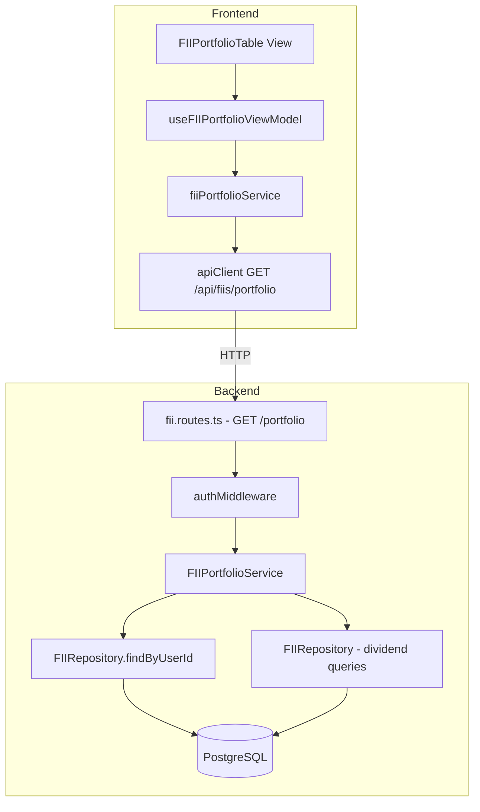
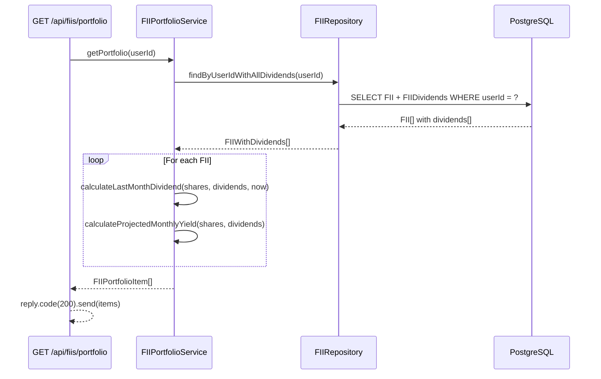

# Design Document: FII Portfolio Table

## Overview

This feature adds a dedicated read-only portfolio table page for FII (Fundos Imobiliários) assets. It introduces a new backend endpoint (`GET /api/fiis/portfolio`) that consolidates FII data with calculated dividend metrics, and a new frontend view (`FIIPortfolioTable`) following the existing MVVM architecture.

The portfolio table displays each FII with: ticker, share count, average price, last month dividend, and projected monthly yield — all computed server-side and served in a single API call.

### Key Design Decisions

1. **Dedicated portfolio endpoint** rather than reusing `GET /api/fiis`: The existing endpoint returns raw FII records. The portfolio endpoint adds calculated fields (lastMonthDividend, projectedMonthlyYield) to avoid frontend calculation complexity and ensure consistent rounding.

2. **Server-side calculation**: All dividend and yield computations happen on the backend to ensure consistency across clients and avoid exposing raw dividend data to the frontend for this view.

3. **New service class (FIIPortfolioService)** rather than extending FIIService: Separation of concerns — the existing FIIService handles CRUD operations, while FIIPortfolioService handles read-only portfolio aggregation with dividend calculations.

4. **Fetch-on-mount pattern**: The portfolio table fetches data when the component mounts (consistent with existing patterns in FIIForm and DashboardView). No real-time push is implemented.

## Architecture



### Route Registration

The new `/portfolio` route is registered within the existing `fiiRoutes` plugin at `/api/fiis/portfolio`. This keeps FII-related routes together and reuses the existing auth middleware hook.

**Important**: The `/portfolio` route MUST be registered before the `/:id` parametric routes in `fii.routes.ts` to avoid Fastify matching "portfolio" as an `:id` parameter.

## Components and Interfaces

### Backend

#### FIIPortfolioService

```typescript
// backend/src/services/fii-portfolio.service.ts

export interface FIIPortfolioItem {
  ticker: string;          // max 6 chars
  shares: number;          // integer, min 1
  averagePrice: number;    // rounded to 2dp
  lastMonthDividend: number;      // rounded to 2dp, 0 if no data
  projectedMonthlyYield: number;  // rounded to 2dp, 0 if no data
}

export interface FIIPortfolioServiceDeps {
  fiiRepository: FIIRepository;
}

export class FIIPortfolioService {
  constructor(deps: FIIPortfolioServiceDeps);

  /**
   * Get the full portfolio for a user.
   * Returns all FIIs with calculated dividend metrics.
   */
  getPortfolio(userId: string): Promise<FIIPortfolioItem[]>;

  /**
   * Calculate last month dividend for a FII.
   * Sum of (dividendPerShare × shares) for all dividends with
   * paymentDate in the previous calendar month.
   */
  calculateLastMonthDividend(
    shares: number,
    dividends: FIIDividendRecord[],
    referenceDate: Date
  ): number;

  /**
   * Calculate projected monthly yield.
   * Most recent dividendPerShare (by paymentDate desc) × shares.
   */
  calculateProjectedMonthlyYield(
    shares: number,
    dividends: FIIDividendRecord[]
  ): number;

  /**
   * Get the previous calendar month date range.
   * Returns [firstDayOfPreviousMonth, lastDayOfPreviousMonth].
   */
  getPreviousMonthRange(referenceDate: Date): [Date, Date];
}
```

#### Route Handler Addition

```typescript
// Added to backend/src/routes/fii.routes.ts

// GET /api/fiis/portfolio - Get consolidated portfolio data
fastify.get('/portfolio', async (request, reply) => {
  const userId = request.user!.id;
  const portfolio = await fiiPortfolioService.getPortfolio(userId);
  return reply.code(200).send(portfolio);
});
```

#### Extended Repository Method

The existing `FIIRepository.findByUserId` already includes `dividends` (take: 1, ordered by paymentDate desc). For the portfolio service, we need ALL dividends for the previous month calculation. A new repository method is needed:

```typescript
// Added to FIIRepository
async findByUserIdWithAllDividends(userId: string): Promise<FIIWithDividends[]> {
  return prisma.fII.findMany({
    where: { userId },
    include: {
      dividends: { orderBy: { paymentDate: 'desc' } },
    },
    orderBy: { createdAt: 'desc' },
  });
}
```

### Frontend

#### fiiPortfolioService

```typescript
// frontend/src/services/fiiPortfolioService.ts

export interface FIIPortfolioItem {
  ticker: string;
  shares: number;
  averagePrice: number;
  lastMonthDividend: number;
  projectedMonthlyYield: number;
}

const fiiPortfolioService = {
  async getPortfolio(): Promise<FIIPortfolioItem[]> {
    const response = await apiClient.get<FIIPortfolioItem[]>('/fiis/portfolio');
    return response.data;
  },
};

export default fiiPortfolioService;
```

#### useFIIPortfolioViewModel

```typescript
// frontend/src/viewmodels/useFIIPortfolioViewModel.ts

export interface UseFIIPortfolioViewModel {
  portfolioItems: FIIPortfolioItem[];
  isLoading: boolean;
  error: string | null;

  loadPortfolio: () => Promise<void>;
  retry: () => Promise<void>;
}

export function useFIIPortfolioViewModel(): UseFIIPortfolioViewModel;
```

#### FIIPortfolioTable View

```typescript
// frontend/src/views/portfolio/FIIPortfolioTable.tsx

export function FIIPortfolioTable(): JSX.Element;
```

The component renders:
- A loading spinner while data is being fetched
- An error state with retry button when the API call fails
- An empty state message when no FIIs exist
- A responsive HTML table with columns: Ticker, Cotas, Preço Médio, Dividendo Último Mês, Rendimento Projetado
- All monetary values formatted in pt-BR locale (R$ X.XXX,XX)
- No edit/delete/action buttons — purely read-only

#### Route Addition

```typescript
// In App.tsx, within protected routes:
<Route path="/carteira-fiis" element={<FIIPortfolioTable />} />
```

## Data Models

### Backend Response DTO

```typescript
interface FIIPortfolioItem {
  ticker: string;               // FII ticker code, max 6 chars (e.g., "HGLG11")
  shares: number;               // Integer, current share count
  averagePrice: number;         // Decimal, 2dp (e.g., 102.35)
  lastMonthDividend: number;    // Decimal, 2dp (e.g., 8.50) or 0.00
  projectedMonthlyYield: number; // Decimal, 2dp (e.g., 8.50) or 0.00
}
```

### Database Query Flow



### Calculation Logic

**Last Month Dividend:**
```
previousMonth = [firstDayOfPreviousMonth, lastDayOfPreviousMonth]
relevantDividends = dividends.filter(d => d.paymentDate ∈ previousMonth)
lastMonthDividend = round2(Σ(d.dividendPerShare × shares) for d in relevantDividends)
```

**Projected Monthly Yield:**
```
mostRecentDividend = dividends[0] (ordered by paymentDate DESC)
projectedMonthlyYield = mostRecentDividend ? round2(mostRecentDividend.dividendPerShare × shares) : 0
```

**Weighted Average Price (on aporte):**
```
newAvgPrice = round2((currentShares × currentAvgPrice + newShares × newPricePerShare) / (currentShares + newShares))
```

**Reverse Weighted Average (on aporte deletion):**
```
newAvgPrice = round2((currentShares × currentAvgPrice − deletedShares × deletedPricePerShare) / (currentShares − deletedShares))
if resultingShares == 0: avgPrice = 0
```

## Correctness Properties

*A property is a characteristic or behavior that should hold true across all valid executions of a system — essentially, a formal statement about what the system should do. Properties serve as the bridge between human-readable specifications and machine-verifiable correctness guarantees.*

### Property 1: Portfolio returns exactly the user's FIIs

*For any* authenticated user with N FIIs in the database, calling `getPortfolio(userId)` SHALL return exactly N items, and the set of tickers in the result SHALL equal the set of tickers belonging to that user. No FIIs from other users SHALL appear in the result.

**Validates: Requirements 1.1, 6.3**

### Property 2: Portfolio response fields are correctly rounded to 2 decimal places

*For any* FII portfolio item returned by `getPortfolio`, the fields `averagePrice`, `lastMonthDividend`, and `projectedMonthlyYield` SHALL each be equal to their mathematically computed value rounded to exactly 2 decimal places (i.e., `Math.round(value * 100) / 100`).

**Validates: Requirements 1.2, 6.1**

### Property 3: Portfolio is sorted by creation date descending

*For any* portfolio result with more than one item, for every consecutive pair of items (item[i], item[i+1]), the creation date of item[i] SHALL be greater than or equal to the creation date of item[i+1].

**Validates: Requirements 1.5**

### Property 4: Last month dividend calculation

*For any* FII with N dividend records and S shares, the `lastMonthDividend` SHALL equal `round2(Σ(d.dividendPerShare × S))` where the sum is over all dividend records `d` with `paymentDate` within the previous calendar month. If no dividends fall within the previous month, the result SHALL be 0.

**Validates: Requirements 2.1, 2.2, 2.3**

### Property 5: Previous month range computation

*For any* reference date D, `getPreviousMonthRange(D)` SHALL return a tuple [start, end] where start is the first day of the month immediately preceding D's month (at 00:00:00) and end is the last day of that month (at 23:59:59.999), inclusive. The returned range SHALL always span exactly one calendar month.

**Validates: Requirements 2.4**

### Property 6: Projected monthly yield calculation

*For any* FII with S shares and a non-empty list of dividend records ordered by paymentDate descending, the `projectedMonthlyYield` SHALL equal `round2(dividends[0].dividendPerShare × S)`. If the dividend list is empty or S is 0, the result SHALL be 0.

**Validates: Requirements 3.1, 3.2, 3.3, 3.4**

### Property 7: Weighted average price on new aporte

*For any* existing FII position with currentShares > 0 and currentAvgPrice > 0, and a new aporte with newShares > 0 and newPricePerShare > 0, the resulting average price SHALL equal `round2((currentShares × currentAvgPrice + newShares × newPricePerShare) / (currentShares + newShares))`.

**Validates: Requirements 4.2, 4.3**

### Property 8: Reverse weighted average on aporte deletion

*For any* FII position resulting from at least 2 aportes, deleting the most recent aporte SHALL produce an average price equal to `round2((currentShares × currentAvgPrice − deletedShares × deletedPricePerShare) / (currentShares − deletedShares))`. If the resulting shares equal 0, the average price SHALL be 0.

**Validates: Requirements 4.4**

## Error Handling

### Backend Errors

| Scenario | HTTP Status | Error Code | Message |
|----------|-------------|------------|---------|
| No auth token / invalid JWT | 401 | `UNAUTHORIZED` | "Authentication required" |
| Database query failure | 500 | `INTERNAL_ERROR` | "An unexpected error occurred" |
| Timeout (query > 2s) | 500 | `INTERNAL_ERROR` | "An unexpected error occurred" |

The backend SHALL NOT expose internal details (stack traces, SQL errors) in error responses. All errors are logged server-side via `console.error`.

### Frontend Error Handling

| Scenario | Behavior |
|----------|----------|
| API returns 401 | apiClient intercepts → clear auth → redirect to /login |
| API returns 500 | Display error message + retry button |
| Network timeout (10s) | Display error message + retry button |
| API returns empty array | Display empty state message |

The ViewModel uses `AbortController` with a 10-second timeout for the portfolio fetch request. On error, the `error` state is set with a user-friendly message and a `retry()` function re-triggers the fetch.

## Testing Strategy

### Property-Based Tests (fast-check)

Property-based testing is well-suited for this feature because:
- The portfolio calculations are pure functions with clear input/output behavior
- The input space is large (varying shares, dividend amounts, dates)
- Universal properties (correct rounding, sorting, calculation formulas) hold across all valid inputs

**Library**: `fast-check` (already used in the project — see `backend/src/services/__tests__/`)

**Configuration**:
- Minimum 100 iterations per property test
- Each test tagged with: `Feature: fii-portfolio-table, Property {N}: {title}`

**Properties to test**:
1. Portfolio returns exactly user's FIIs
2. Response fields rounded to 2dp
3. Portfolio sorted by creation date descending
4. Last month dividend calculation
5. Previous month range computation
6. Projected monthly yield calculation
7. Weighted average price on new aporte
8. Reverse weighted average on aporte deletion

### Unit Tests (Vitest)

**Backend**:
- `FIIPortfolioService.getPortfolio` — empty portfolio returns []
- `FIIPortfolioService.getPortfolio` — FII without dividends returns 0 for calculated fields
- Route handler returns 401 when unauthenticated
- Route handler returns 500 on service error

**Frontend**:
- `useFIIPortfolioViewModel` — calls API on `loadPortfolio()`
- `useFIIPortfolioViewModel` — sets error state on API failure
- `useFIIPortfolioViewModel` — retry re-fetches data
- `FIIPortfolioTable` — renders table with correct columns
- `FIIPortfolioTable` — shows empty state when no items
- `FIIPortfolioTable` — shows error state with retry button
- `FIIPortfolioTable` — no edit/delete buttons rendered
- `FIIPortfolioTable` — formats monetary values in pt-BR locale

### Integration Tests

- Full request cycle: authenticated user → GET /api/fiis/portfolio → correct response
- User isolation: user A cannot see user B's FIIs through portfolio endpoint
