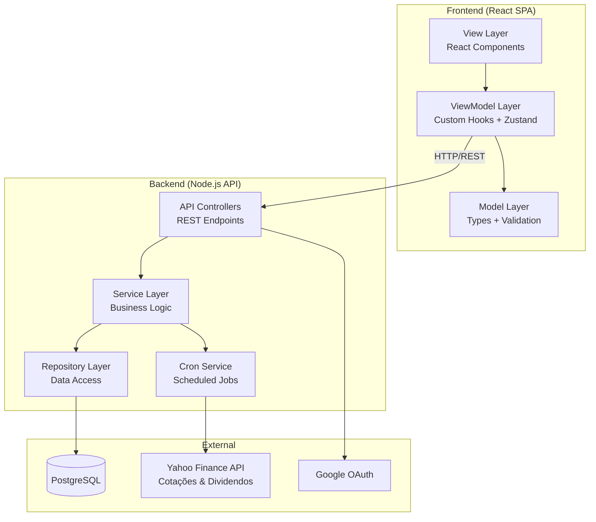
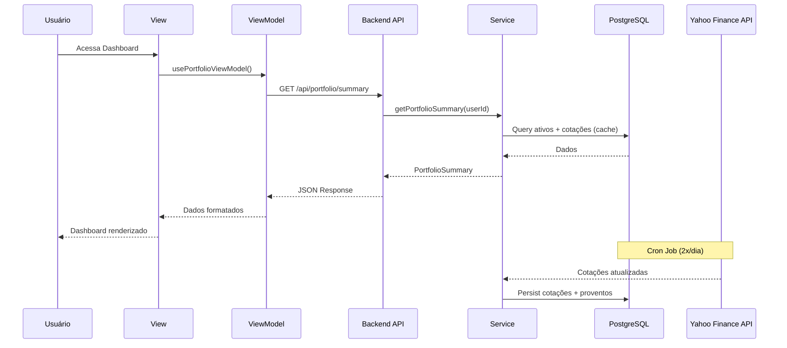

# Design Document: Investment Portfolio Manager

## Overview

O Investment Portfolio Manager é uma aplicação web SPA (Single Page Application) construída com TypeScript e React, seguindo arquitetura MVVM e princípios SOLID. A aplicação permite ao usuário gerenciar sua carteira pessoal de investimentos em Renda Fixa e Fundos Imobiliários (FIIs), com atualização automática de cotações, cálculos de rentabilidade e projeções de dividendos.

### Decisões Técnicas Principais

| Decisão | Escolha | Justificativa |
|---------|---------|---------------|
| Frontend Framework | React 18+ com TypeScript | Tipagem estática, ecossistema maduro, componentização |
| Arquitetura | MVVM (Model-View-ViewModel) | Separação de responsabilidades, testabilidade |
| State Management | Zustand | Leve, TypeScript-first, compatível com MVVM |
| Backend Runtime | Node.js com Express/Fastify | Unificação de stack TypeScript |
| Banco de Dados | PostgreSQL | Dados financeiros relacionais, ACID compliance |
| ORM | Prisma | Type-safe queries, migrations automáticas |
| Autenticação | JWT + OAuth 2.0 (Google) | Stateless sessions, padrão de mercado |
| Cron Jobs | node-cron ou Bull Queue | Agendamento de tarefas de atualização |
| API de Mercado | Yahoo Finance API (gratuita) | Cotações e dividendos de FIIs brasileiros, sem token |
| Charts | Recharts ou Chart.js | Compatível com React, performático |
| Export | ExcelJS + csv-writer | Suporte CSV e Excel nativo |
| CSS Framework | Tailwind CSS | Mobile First, utility-first |
| Testes | Vitest + fast-check | Unit tests + property-based testing |

## Architecture

A arquitetura segue o padrão MVVM adaptado para React com uma camada de serviços backend separada.



### Camadas da Arquitetura

**View Layer (Camada de Apresentação)**
- Componentes React puros responsáveis apenas pela renderização
- Não contêm lógica de negócio
- Recebem dados formatados dos ViewModels

**ViewModel Layer (Camada de Lógica de Apresentação)**
- Custom hooks que encapsulam a lógica de estado e transformação de dados
- Gerenciam chamadas à API via services
- Formatam dados para apresentação na View
- Implementados como custom hooks React + stores Zustand

**Model Layer (Camada de Domínio)**
- Tipos TypeScript, interfaces e schemas de validação
- Regras de validação com Zod
- Entidades de domínio compartilhadas entre frontend e backend

**Service Layer (Backend)**
- Lógica de negócio: cálculos financeiros, projeções, validações complexas
- Orquestração de operações entre repositórios

**Repository Layer (Backend)**
- Acesso a dados via Prisma ORM
- Operações CRUD atômicas
- Transações para operações compostas (ex: registro de aporte)

**Cron Service (Backend)**
- Agendamento de tarefas de atualização de cotações e indicadores
- Rate limiting e retry logic para API externa
- Cache management

### Fluxo de Dados



## Components and Interfaces

### Frontend Components

#### Views (React Components)

```typescript
// Estrutura de pastas
src/
├── views/
│   ├── auth/
│   │   ├── LoginView.tsx
│   │   └── RegisterView.tsx
│   ├── dashboard/
│   │   ├── DashboardView.tsx
│   │   ├── PatrimonyChart.tsx
│   │   ├── DividendChart.tsx
│   │   ├── AllocationPieChart.tsx
│   │   └── AssetSummaryCard.tsx
│   ├── assets/
│   │   ├── AssetListView.tsx
│   │   ├── RendaFixaForm.tsx
│   │   ├── FIIForm.tsx
│   │   └── AporteForm.tsx
│   └── export/
│       └── ExportView.tsx
├── viewmodels/
│   ├── useAuthViewModel.ts
│   ├── usePortfolioViewModel.ts
│   ├── useRendaFixaViewModel.ts
│   ├── useFIIViewModel.ts
│   ├── useAporteViewModel.ts
│   ├── useDashboardViewModel.ts
│   └── useExportViewModel.ts
├── models/
│   ├── types.ts
│   ├── schemas.ts
│   └── validators.ts
├── services/
│   ├── api.ts
│   ├── authService.ts
│   ├── portfolioService.ts
│   └── exportService.ts
└── stores/
    ├── authStore.ts
    └── portfolioStore.ts
```

#### Interfaces de ViewModel (Frontend)

```typescript
// useRendaFixaViewModel.ts
interface UseRendaFixaViewModel {
  // State
  rendaFixaList: RendaFixaAsset[];
  isLoading: boolean;
  error: string | null;
  validationErrors: Record<string, string>;

  // Actions
  createRendaFixa(data: CreateRendaFixaDTO): Promise<void>;
  updateRendaFixa(id: string, data: UpdateRendaFixaDTO): Promise<void>;
  deleteRendaFixa(id: string): Promise<void>;
  validateForm(data: Partial<CreateRendaFixaDTO>): ValidationResult;
}

// useFIIViewModel.ts
interface UseFIIViewModel {
  fiiList: FIIAsset[];
  isLoading: boolean;
  error: string | null;
  validationErrors: Record<string, string>;

  createFII(data: CreateFIIDTO): Promise<void>;
  updateFII(id: string, data: UpdateFIIDTO): Promise<void>;
  deleteFII(id: string): Promise<void>;
  validateTicker(ticker: string): boolean;
}

// useAporteViewModel.ts
interface UseAporteViewModel {
  aporteHistory: Aporte[];
  isLoading: boolean;
  error: string | null;

  registerAporte(data: CreateAporteDTO): Promise<void>;
  getAportesByAsset(assetId: string): Aporte[];
}

// useDashboardViewModel.ts
interface UseDashboardViewModel {
  totalPatrimony: number;
  allocationData: AllocationData;
  patrimonyHistory: PatrimonyPoint[];
  dividendHistory: DividendPoint[];
  dividendProjection: DividendProjection;
  fiiPerformance: FIIPerformanceData[];
  isLoading: boolean;
  isStale: boolean;

  refreshData(): Promise<void>;
}

// useExportViewModel.ts
interface UseExportViewModel {
  isExporting: boolean;
  exportError: string | null;

  exportToCSV(): Promise<void>;
  exportToExcel(): Promise<void>;
}
```

### Backend API Endpoints

```typescript
// Auth Routes
POST   /api/auth/register          // Registro com email/senha
POST   /api/auth/login             // Login com email/senha
POST   /api/auth/google            // Login com Google OAuth
POST   /api/auth/logout            // Logout
POST   /api/auth/refresh           // Refresh token

// Renda Fixa Routes
GET    /api/renda-fixa             // Listar títulos
POST   /api/renda-fixa             // Criar título
PUT    /api/renda-fixa/:id         // Atualizar título
DELETE /api/renda-fixa/:id         // Remover título

// FII Routes
GET    /api/fiis                   // Listar FIIs
POST   /api/fiis                   // Cadastrar FII
PUT    /api/fiis/:id               // Atualizar FII
DELETE /api/fiis/:id               // Remover FII

// Aportes Routes
GET    /api/aportes                // Listar aportes
GET    /api/aportes/:assetId       // Aportes por ativo
POST   /api/aportes                // Registrar aporte

// Dashboard Routes
GET    /api/dashboard/summary      // Resumo patrimonial
GET    /api/dashboard/patrimony-history  // Evolução patrimonial
GET    /api/dashboard/dividends    // Histórico + projeção dividendos
GET    /api/dashboard/allocation   // Alocação por classe

// Export Routes
POST   /api/export/csv             // Gerar CSV
POST   /api/export/excel           // Gerar Excel

// Market Data (internal)
POST   /api/admin/cron/update-quotes   // Trigger manual (admin)
```

### Backend Service Interfaces

```typescript
// IMarketDataService - Princípio ISP (Interface Segregation)
interface IMarketDataService {
  fetchQuote(ticker: string): Promise<QuoteData>;
  fetchDividendData(ticker: string): Promise<DividendData>;
}

// ICalculationService
interface ICalculationService {
  calculateRendaFixaProjection(asset: RendaFixaAsset, cdiRate: number, ipcaRate: number): ProjectionResult;
  calculateAveragePrice(currentQty: number, currentAvg: number, newQty: number, newPrice: number): number;
  calculateDividendProjection(fiis: FIIWithQuote[]): DividendProjectionResult;
  calculatePatrimonyTotal(rendaFixa: RendaFixaAsset[], fiis: FIIWithQuote[]): number;
}

// ICronService
interface ICronService {
  scheduleQuoteUpdate(schedule: string): void;
  executeQuoteUpdate(): Promise<CronExecutionResult>;
  getLastExecution(): CronExecutionLog;
}

// IExportService
interface IExportService {
  generateCSV(userId: string): Promise<Buffer>;
  generateExcel(userId: string): Promise<Buffer>;
}

// IAuthService
interface IAuthService {
  register(email: string, password: string): Promise<AuthResult>;
  login(email: string, password: string): Promise<AuthResult>;
  loginWithGoogle(token: string): Promise<AuthResult>;
  logout(sessionId: string): Promise<void>;
  refreshToken(refreshToken: string): Promise<AuthResult>;
  validateSession(token: string): Promise<UserSession>;
}
```

## Data Models

### Entidades do Banco de Dados (Prisma Schema)

```prisma
model User {
  id            String    @id @default(uuid())
  email         String    @unique
  passwordHash  String?
  googleId      String?   @unique
  name          String?
  createdAt     DateTime  @default(now())
  updatedAt     DateTime  @updatedAt

  rendaFixa     RendaFixa[]
  fiis          FII[]
  aportes       Aporte[]
  sessions      Session[]
}

model Session {
  id          String   @id @default(uuid())
  userId      String
  token       String   @unique
  expiresAt   DateTime
  createdAt   DateTime @default(now())
  lastActivity DateTime @default(now())

  user        User     @relation(fields: [userId], references: [id])
}

model RendaFixa {
  id              String    @id @default(uuid())
  userId          String
  institution     String    @db.VarChar(100)
  investedAmount  Decimal   @db.Decimal(14, 2)
  maturityDate    DateTime
  rateType        RateType
  rateValue       Decimal   @db.Decimal(6, 4)
  ipcaPlusRate    Decimal?  @db.Decimal(5, 4)
  createdAt       DateTime  @default(now())
  updatedAt       DateTime  @updatedAt

  user            User      @relation(fields: [userId], references: [id])
  aportes         Aporte[]
}

model FII {
  id            String    @id @default(uuid())
  userId        String
  ticker        String    @db.VarChar(6)
  shares        Int
  averagePrice  Decimal   @db.Decimal(10, 2)
  purchaseDate  DateTime
  createdAt     DateTime  @default(now())
  updatedAt     DateTime  @updatedAt

  user          User      @relation(fields: [userId], references: [id])
  aportes       Aporte[]
  quotes        FIIQuote[]
  dividends     FIIDividend[]
}

model FIIQuote {
  id          String   @id @default(uuid())
  fiiId       String
  price       Decimal  @db.Decimal(10, 2)
  sourceDate  DateTime
  updatedAt   DateTime @default(now())

  fii         FII      @relation(fields: [fiiId], references: [id])

  @@index([fiiId, updatedAt])
}

model FIIDividend {
  id              String   @id @default(uuid())
  fiiId           String
  dividendPerShare Decimal @db.Decimal(10, 6)
  dividendYield   Decimal  @db.Decimal(5, 2)
  paymentDate     DateTime
  updatedAt       DateTime @default(now())

  fii             FII      @relation(fields: [fiiId], references: [id])

  @@index([fiiId, paymentDate])
}

model Aporte {
  id            String      @id @default(uuid())
  userId        String
  assetType     AssetType
  rendaFixaId   String?
  fiiId         String?
  amount        Decimal     @db.Decimal(14, 2)
  shares        Int?
  pricePerShare Decimal?    @db.Decimal(10, 2)
  operationType OperationType
  date          DateTime
  createdAt     DateTime    @default(now())

  user          User        @relation(fields: [userId], references: [id])
  rendaFixa     RendaFixa?  @relation(fields: [rendaFixaId], references: [id])
  fii           FII?        @relation(fields: [fiiId], references: [id])

  @@index([userId, date])
}

model MarketIndex {
  id        String   @id @default(uuid())
  indexType IndexType
  value     Decimal  @db.Decimal(10, 6)
  date      DateTime
  updatedAt DateTime @default(now())

  @@unique([indexType, date])
  @@index([indexType, date])
}

model CronLog {
  id              String   @id @default(uuid())
  executionDate   DateTime @default(now())
  successCount    Int
  failureCount    Int
  errors          Json?
  duration        Int      // milliseconds
}

enum RateType {
  CDI_PERCENTAGE
  IPCA_PLUS
}

enum AssetType {
  RENDA_FIXA
  FII
}

enum OperationType {
  NEW_POSITION
  EXISTING_POSITION
}

enum IndexType {
  CDI
  IPCA
}
```

### DTOs (Data Transfer Objects)

```typescript
// === Renda Fixa DTOs ===
interface CreateRendaFixaDTO {
  institution: string;      // max 100 chars
  investedAmount: number;   // 0.01 to 999_999_999.99
  maturityDate: string;     // ISO 8601, must be future
  rateType: 'CDI_PERCENTAGE' | 'IPCA_PLUS';
  rateValue: number;        // CDI: 1-999, IPCA+: 0.01-99.99
}

// === FII DTOs ===
interface CreateFIIDTO {
  ticker: string;           // /^[A-Z]{4}\d{2}$/
  shares: number;           // >= 1, integer
  averagePrice: number;     // > 0
  purchaseDate: string;     // ISO 8601
}

// === Aporte DTOs ===
interface CreateAporteDTO {
  assetType: 'RENDA_FIXA' | 'FII';
  assetId?: string;         // null = nova posição
  // Para Renda Fixa:
  amount?: number;          // 0.01 to 999_999_999.99
  // Para FII:
  shares?: number;          // >= 1
  pricePerShare?: number;   // > 0
  date: string;             // ISO 8601
}

// === Dashboard DTOs ===
interface PortfolioSummary {
  totalPatrimony: number;
  rendaFixaTotal: number;
  fiiTotal: number;
  rendaFixaPercentage: number;
  fiiPercentage: number;
  estimatedMonthlyDividends: number;
}

interface PatrimonyPoint {
  month: string;            // YYYY-MM
  value: number;
}

interface DividendPoint {
  month: string;            // YYYY-MM
  value: number;
  isProjection: boolean;
}

interface FIIPerformanceData {
  ticker: string;
  shares: number;
  averagePrice: number;
  currentPrice: number;
  marketValue: number;
  acquisitionValue: number;
  variationPercent: number; // positivo = valorização
  lastDividend: number;
  dividendYield: number;
  lastUpdateDate: string;
  isStale: boolean;         // > 48h sem atualização
}

// === Export DTOs ===
interface ExportRow {
  date: string;             // YYYY-MM-DD
  assetName: string;
  assetType: 'Renda_Fixa' | 'FII';
  investedAmount: number;
  shares: number | null;
  currentBalance: number;
}
```

### Schemas de Validação (Zod)

```typescript
import { z } from 'zod';

export const rendaFixaSchema = z.object({
  institution: z.string().min(1).max(100),
  investedAmount: z.number().min(0.01).max(999_999_999.99),
  maturityDate: z.string().refine(
    (date) => new Date(date) > new Date(),
    { message: 'Data de vencimento deve ser futura' }
  ),
  rateType: z.enum(['CDI_PERCENTAGE', 'IPCA_PLUS']),
  rateValue: z.number().positive(),
}).refine(
  (data) => {
    if (data.rateType === 'CDI_PERCENTAGE') {
      return data.rateValue >= 1 && data.rateValue <= 999;
    }
    if (data.rateType === 'IPCA_PLUS') {
      return data.rateValue >= 0.01 && data.rateValue <= 99.99;
    }
    return false;
  },
  { message: 'Taxa fora do intervalo permitido para o tipo selecionado' }
);

export const fiiSchema = z.object({
  ticker: z.string().regex(/^[A-Z]{4}\d{2}$/, 'Ticker deve seguir formato: 4 letras + 2 dígitos (ex: MXRF11)'),
  shares: z.number().int().min(1, 'Quantidade de cotas deve ser no mínimo 1'),
  averagePrice: z.number().positive('Preço médio deve ser positivo'),
  purchaseDate: z.string().datetime(),
});

export const aporteRendaFixaSchema = z.object({
  assetType: z.literal('RENDA_FIXA'),
  assetId: z.string().uuid().optional(),
  amount: z.number().min(0.01).max(999_999_999.99),
  date: z.string().datetime(),
});

export const aporteFIISchema = z.object({
  assetType: z.literal('FII'),
  assetId: z.string().uuid().optional(),
  shares: z.number().int().min(1),
  pricePerShare: z.number().positive(),
  date: z.string().datetime(),
});
```


## Correctness Properties

*Uma propriedade é uma característica ou comportamento que deve ser verdadeiro em todas as execuções válidas de um sistema — essencialmente, uma declaração formal sobre o que o sistema deve fazer. Propriedades servem como ponte entre especificações legíveis por humanos e garantias de correção verificáveis por máquina.*

### Property 1: Validação de Renda Fixa aceita entradas válidas e rejeita inválidas

*For any* entrada com instituição de 1-100 caracteres, valor entre 0.01 e 999999999.99, data de vencimento futura e taxa no formato CDI (1-999%) ou IPCA+ (0.01-99.99%), a validação SHALL aceitar a entrada. *For any* entrada que viole qualquer dessas regras (campos vazios, valor ≤ 0, data passada, taxa fora do intervalo), a validação SHALL rejeitar e retornar mensagens de erro indicando os campos inválidos.

**Validates: Requirements 1.1, 1.2, 1.3, 1.5, 1.6, 1.7**

### Property 2: Validação de FII aceita tickers válidos e rejeita inválidos

*For any* string, a validação de ticker SHALL aceitar se e somente se a string corresponder ao padrão `/^[A-Z]{4}\d{2}$/`. *For any* entrada com shares ≤ 0 ou averagePrice ≤ 0, a validação SHALL rejeitar o cadastro.

**Validates: Requirements 2.1, 2.2, 2.3, 2.4**

### Property 3: Aporte em Renda Fixa soma ao saldo existente

*For any* título de Renda Fixa com saldo S e qualquer aporte válido de valor V (onde 0.01 ≤ V ≤ 999999999.99), o novo saldo SHALL ser exatamente S + V.

**Validates: Requirements 3.1**

### Property 4: Recálculo de Preço Médio de FII

*For any* FII com quantidade anterior Q₁ e preço médio P₁, e qualquer aporte com quantidade nova Q₂ (≥ 1) e preço P₂ (> 0), o novo preço médio SHALL ser igual a (Q₁ × P₁ + Q₂ × P₂) / (Q₁ + Q₂), e a nova quantidade SHALL ser Q₁ + Q₂.

**Validates: Requirements 3.2**

### Property 5: Completude do Histórico de Aportes

*For any* sequência de N aportes válidos registrados com sucesso, o histórico SHALL conter exatamente N entradas, cada uma com data, valor, identificação do ativo e tipo de operação corretos.

**Validates: Requirements 3.4**

### Property 6: Detecção de Dados Desatualizados (Staleness)

*For any* FII com timestamp de última atualização de cotação T, o sistema SHALL marcar como desatualizado (isStale = true) se e somente se (now - T) > 48 horas. *For any* FII com timestamp de último provento P, o sistema SHALL marcar dividendos como desatualizados se e somente se (now - P) > 60 dias.

**Validates: Requirements 4.4, 5.5**

### Property 7: Cálculo de Projeção de Dividendos

*For any* carteira com N FIIs, onde o FII_i possui Q_i cotas e último provento por cota D_i, a projeção total de dividendos SHALL ser igual a Σ(Q_i × D_i) para i de 1 até N, com precisão de 2 casas decimais. Se D_i não estiver disponível para um FII, SHALL considerar D_i = 0.

**Validates: Requirements 6.1, 6.4**

### Property 8: Cálculo de Rentabilidade CDI com Juros Compostos

*For any* título de Renda Fixa atrelado ao CDI com valor investido V, taxa contratada P% do CDI e taxa CDI diária R, após D dias úteis o saldo projetado SHALL ser igual a V × (1 + R × P/100)^D.

**Validates: Requirements 7.1**

### Property 9: Cálculo de Rentabilidade IPCA + Taxa Fixa

*For any* título de Renda Fixa atrelado ao IPCA com valor investido V, último IPCA anual I e taxa fixa T%, após D dias úteis o saldo projetado SHALL ser igual a V × (1 + I + T/100)^(D/252).

**Validates: Requirements 7.3**

### Property 10: Cálculo do Patrimônio Total

*For any* carteira contendo M títulos de Renda Fixa com saldos projetados RF₁...RF_M e N FIIs com quantidades Q₁...Q_N e cotações atuais C₁...C_N, o patrimônio total SHALL ser igual a Σ(RF_j) + Σ(Q_i × C_i).

**Validates: Requirements 8.1**

### Property 11: Percentuais de Alocação Somam 100%

*For any* carteira com patrimônio total > 0, o percentual de Renda Fixa + percentual de FIIs SHALL ser exatamente 100.00%. Se a carteira tiver apenas uma classe de ativos, essa classe SHALL representar 100%.

**Validates: Requirements 8.2, 8.3**

### Property 12: Cálculo de Variação Percentual de FII

*For any* FII com preço médio PM > 0 e cotação atual CA, a variação percentual SHALL ser igual a ((CA - PM) / PM) × 100. O sinal da variação (positivo, negativo ou zero) SHALL determinar a indicação visual (verde, vermelho ou neutro respectivamente).

**Validates: Requirements 8.4, 8.5, 8.6**

### Property 13: Limite de Retentativas na API Externa

*For any* execução do Cron Job, se a API retornar erro, o sistema SHALL realizar no máximo 3 tentativas por execução, com intervalo mínimo de 60 segundos entre cada tentativa.

**Validates: Requirements 11.3**

### Property 14: Bloqueio de Conta após Tentativas Falhas

*For any* conta de usuário, após exatamente 5 tentativas consecutivas de login com falha, a conta SHALL ser bloqueada por 15 minutos. Antes de 5 tentativas, a conta SHALL permanecer desbloqueada. Após o período de bloqueio, a conta SHALL ser desbloqueada.

**Validates: Requirements 14.2**

### Property 15: Expiração de Sessão por Inatividade

*For any* sessão autenticada com última atividade no timestamp T, a sessão SHALL ser considerada válida se e somente se (now - T) ≤ 30 minutos.

**Validates: Requirements 14.4**

### Property 16: Completude dos Dados de Exportação

*For any* carteira com N aportes registrados, o arquivo exportado (CSV ou Excel) SHALL conter exatamente N linhas de dados, e cada linha SHALL conter: data (formato AAAA-MM-DD), nome do ativo, tipo (Renda_Fixa ou FII), valor investido (2 casas decimais), quantidade de cotas (quando FII) e saldo calculado.

**Validates: Requirements 15.1, 15.2**

## Error Handling

### Estratégia de Tratamento de Erros por Camada

#### Frontend (View/ViewModel)

| Cenário | Comportamento |
|---------|---------------|
| Erro de validação de formulário | Exibir mensagem inline no campo correspondente, sem submeter |
| Erro de rede (API indisponível) | Exibir notificação de erro persistente com botão "tentar novamente" |
| Erro de autenticação (401) | Redirecionar para tela de login |
| Erro de autorização (403) | Exibir mensagem "acesso negado" |
| Timeout de requisição (>10s) | Cancelar request, exibir mensagem com opção de retry |
| Erro genérico do servidor (500) | Exibir notificação genérica "erro inesperado, tente novamente" |

#### Backend (Service Layer)

| Cenário | Comportamento |
|---------|---------------|
| Validação de DTO falha (Zod) | Retornar HTTP 400 com lista de campos inválidos |
| Entidade não encontrada | Retornar HTTP 404 |
| Conflito de dados (ex: ticker duplicado) | Retornar HTTP 409 |
| Falha de transação no DB | Rollback automático, retornar HTTP 500, logar erro |
| Rate limit excedido (API externa) | Retry com backoff, até 3 tentativas |
| Timeout na API externa (>30s) | Manter cache, logar erro, continuar com próximos FIIs |

#### Cron Jobs

| Cenário | Comportamento |
|---------|---------------|
| API externa retorna erro | Manter última cotação válida, logar erro, prosseguir |
| API externa timeout (>30s/request) | Igual ao erro, prosseguir com demais FIIs |
| Rate limit atingido | Aguardar 60s, retry até 3x por execução |
| Todas tentativas falharam | Manter cache, registrar em CronLog (failureCount++) |
| Erro interno no cron | Logar stack trace, não interromper próximas execuções |

### Tratamento Transacional

Para operações compostas (ex: registro de aporte que altera saldo + cria histórico), utilizar transações Prisma:

```typescript
// Exemplo: Aporte em FII com recálculo de preço médio
async registerFIIAporte(data: CreateAporteDTO): Promise<void> {
  await prisma.$transaction(async (tx) => {
    const fii = await tx.fII.findUniqueOrThrow({ where: { id: data.assetId } });
    
    const newAvgPrice = calculateAveragePrice(
      fii.shares, fii.averagePrice,
      data.shares!, data.pricePerShare!
    );

    await tx.fII.update({
      where: { id: data.assetId },
      data: {
        shares: fii.shares + data.shares!,
        averagePrice: newAvgPrice,
      }
    });

    await tx.aporte.create({
      data: {
        userId: data.userId,
        assetType: 'FII',
        fiiId: data.assetId,
        amount: data.shares! * data.pricePerShare!,
        shares: data.shares,
        pricePerShare: data.pricePerShare,
        operationType: 'EXISTING_POSITION',
        date: new Date(data.date),
      }
    });
  });
  // Se a transação falhar, nenhuma alteração é persistida (Req 3.6)
}
```

### Notificações Visuais

- **Sucesso**: Toast verde com ícone de check, auto-dismiss em 5 segundos (Req 13.4)
- **Erro**: Toast vermelho com ícone de alerta, persistente até dismiss manual (Req 13.5)
- **Ação destrutiva**: Modal de confirmação antes de executar (Req 13.2)
- **Dados desatualizados**: Badge/tooltip informativo junto ao dado afetado (Req 4.4, 5.5)

## Testing Strategy

### Abordagem Dual de Testes

O projeto utiliza uma abordagem complementar de testes unitários (exemplos específicos) e testes baseados em propriedades (verificação universal):

#### Testes Unitários (Vitest)

Focam em:
- Exemplos específicos que demonstram comportamento correto
- Pontos de integração entre componentes
- Edge cases e condições de erro
- Comportamentos de UI (renderização, interação)
- Integrações com serviços externos (mocked)

#### Testes Baseados em Propriedades (fast-check + Vitest)

Focam em:
- Propriedades universais que devem valer para todas as entradas válidas
- Cobertura abrangente do espaço de entrada via randomização
- Validação de fórmulas matemáticas e cálculos financeiros
- Invariantes de dados e regras de validação

### Biblioteca de Property-Based Testing

- **Biblioteca**: [fast-check](https://github.com/dubzzz/fast-check)
- **Runtime**: Vitest
- **Mínimo de iterações**: 100 por propriedade
- **Tagging**: Cada teste referencia a propriedade do design document

```typescript
// Exemplo de configuração
import fc from 'fast-check';
import { describe, it, expect } from 'vitest';

describe('Feature: investment-portfolio-manager', () => {
  it('Property 4: Recálculo de Preço Médio de FII', () => {
    fc.assert(
      fc.property(
        fc.integer({ min: 1, max: 100000 }),   // qtdAnterior
        fc.float({ min: 0.01, max: 10000 }),   // preçoMédioAnterior
        fc.integer({ min: 1, max: 100000 }),   // qtdNova
        fc.float({ min: 0.01, max: 10000 }),   // preçoNovo
        (qtdAnt, pmAnt, qtdNova, precoNovo) => {
          const result = calculateAveragePrice(qtdAnt, pmAnt, qtdNova, precoNovo);
          const expected = (qtdAnt * pmAnt + qtdNova * precoNovo) / (qtdAnt + qtdNova);
          expect(result).toBeCloseTo(expected, 2);
        }
      ),
      { numRuns: 100 }
    );
  });
});
```

### Mapeamento de Propriedades para Testes

| Propriedade | Tipo de Teste | Módulo/Arquivo |
|-------------|---------------|----------------|
| Property 1: Validação RendaFixa | PBT | `validators.property.test.ts` |
| Property 2: Validação FII | PBT | `validators.property.test.ts` |
| Property 3: Aporte soma saldo RF | PBT | `aporte.property.test.ts` |
| Property 4: Preço Médio FII | PBT | `calculations.property.test.ts` |
| Property 5: Histórico completo | PBT | `aporte.property.test.ts` |
| Property 6: Staleness detection | PBT | `staleness.property.test.ts` |
| Property 7: Projeção dividendos | PBT | `calculations.property.test.ts` |
| Property 8: Rentabilidade CDI | PBT | `calculations.property.test.ts` |
| Property 9: Rentabilidade IPCA | PBT | `calculations.property.test.ts` |
| Property 10: Patrimônio total | PBT | `calculations.property.test.ts` |
| Property 11: Alocação 100% | PBT | `calculations.property.test.ts` |
| Property 12: Variação % FII | PBT | `calculations.property.test.ts` |
| Property 13: Retry limit | PBT | `cron.property.test.ts` |
| Property 14: Account lockout | PBT | `auth.property.test.ts` |
| Property 15: Session timeout | PBT | `auth.property.test.ts` |
| Property 16: Export completude | PBT | `export.property.test.ts` |

### Testes de Integração

- Fluxo completo de autenticação (email/senha e Google OAuth)
- Operações CRUD com banco de dados real (test container)
- Cron job execution com API externa mockada
- Exportação CSV/Excel com dados reais

### Testes de UI/E2E

- Responsividade Mobile First (Playwright/Cypress)
- Fluxos críticos: login → cadastro de ativo → visualização no dashboard
- Acessibilidade (area de toque 44x44px, contraste de cores)
- Performance (FCP < 1s, TTI < 3s)
